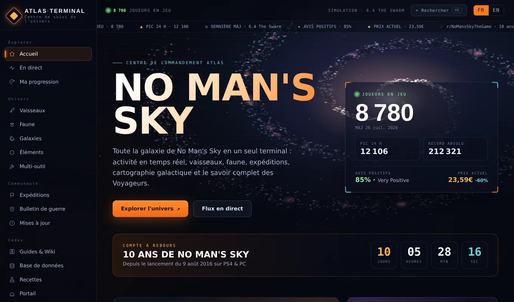

<div align="center">

# Atlas Terminal

**Le centre de suivi non officiel de No Man's Sky** — activité en direct, encyclopédie complète du jeu et suivi de progression, réunis dans une seule interface.

[](https://github.com/Micka420-collab/no-man/actions/workflows/deploy-site.yml)
[](https://github.com/Micka420-collab/no-man/actions/workflows/update-news.yml)


**[→ Ouvrir le site](https://micka420-collab.github.io/no-man/)**



</div>

---

## Sommaire

- [Aperçu](#aperçu)
- [Fonctionnalités](#fonctionnalités)
- [Architecture](#architecture)
- [Chaîne de données](#chaîne-de-données)
- [Développement](#développement)
- [Principes de données](#principes-de-données)
- [Sources et crédits](#sources-et-crédits)
- [Mentions légales](#mentions-légales)

---

## Aperçu

Atlas Terminal rassemble en un seul endroit ce qui est habituellement éparpillé entre une
douzaine de sites : les statistiques Steam en temps réel, les actualités officielles, les
bases de données d'objets et de recettes, les guides, la cartographie galactique et les
outils de planification.

L'application est **entièrement statique** : aucun serveur, aucune base de données, aucun
compte. Les données sont collectées en amont par des workflows GitHub Actions, versionnées
dans le dépôt, puis servies telles quelles au navigateur. Les préférences et la progression
restent dans le `localStorage` de l'utilisateur.

| | |
|---|---|
| **Interface** | Bilingue FR/EN, thèmes sombre/clair, navigation clavier, `prefers-reduced-motion` respecté |
| **Mobile** | Barre de navigation basse, mise en page adaptative testée de 360 px à 1920 px |
| **Hors-ligne** | PWA installable, coquille en cache, données en réseau-d'abord avec repli local |
| **Performance** | Chargement différé par section, bundle initial de 83 ko compressé |
| **Fraîcheur** | Données rafraîchies toutes les 3 heures, site redéployé automatiquement dans la foulée |

## Fonctionnalités

<details open>
<summary><b>Suivi en direct et communauté</b></summary>

- **Accueil / En direct** — joueurs connectés en temps réel, pic 24 h, record absolu, courbe
  historique, avis Steam et prix courant ; flux d'activité mêlant Reddit (FR + EN), vidéos et
  actualités officielles.
- **Bulletin de guerre** — classement des escouades de l'événement communautaire en cours.
- **Expéditions** — calendrier des 22 expéditions communautaires (2021 → 2026) avec statut.
- **Mises à jour** — frise chronologique des versions majeures depuis 2016.

</details>

<details open>
<summary><b>Encyclopédie du jeu</b></summary>

- **Base de données** — plus de 3 500 objets avec valeur, catégorie, icône réelle et
  description du jeu ; filtres par devise, valeur minimale et tri.
- **Recettes** — 357 recettes de raffinage et plus de 1 300 recettes de cuisine, navigables
  dans les deux sens (« comment l'obtenir » / « ce qu'il permet de fabriquer »).
- **Éléments** — tableau périodique des 72 substances réelles, relié à la chimie du jeu.
- **Faune** — 57 archétypes de créatures et leurs récoltes.
- **Vaisseaux** — archétypes, comparatif complet des cargos (17 types en images), 6 types de
  frégates, guide d'optimisation.
- **Guides & Wiki** — 13 guides pratiques et l'encyclopédie narrative (trame, 14 missions,
  secrets et clins d'œil).

</details>

<details open>
<summary><b>Outils</b></summary>

- **Ateliers 3D** — bancs d'essai multi-outil et vaisseau : modèles procéduraux en temps réel
  (rendu PBR, plaques de coque, adjacence des technologies, emplacements survoltés).
- **Portail** — décodeur d'adresses de portail (les 16 glyphes), conversion en balise de
  signal, carnet d'adresses et carte stellaire 3D aux proportions réelles du jeu.
- **Galaxies** — cartographie interactive des 255 galaxies.
- **Recherche universelle** — `⌘K` / `Ctrl+K`, tolérante aux accents et aux fautes de frappe,
  sur l'ensemble des données du site.
- **Ma progression** — checklist d'objectifs, sauvegarde et restauration de toutes les
  données locales dans un fichier.

</details>

## Architecture

Le dépôt héberge **deux applications**, volontairement :

```
no-man/
├── site/                        ← Atlas Terminal — l'application servie en production
│   ├── src/
│   │   ├── sections/            ·  15 sections (Home, Live, Ships, Recipes…)
│   │   ├── components/          ·  Viewer3D, Workshop, NavRail, SearchOverlay…
│   │   ├── lib/                 ·  store, meshes procéduraux, utilitaires
│   │   ├── data/ · i18n/        ·  catalogue statique, chaînes FR/EN
│   │   └── styles/global.css
│   ├── public/
│   │   ├── data/*.json          ·  copie servie au navigateur (synchronisée au build)
│   │   ├── assets/              ·  vaisseaux, créatures, cargos, frégates
│   │   └── sw.js · manifest     ·  service worker et manifeste PWA
│   └── scripts/
│       └── build-workshop-data.mjs   ·  régénère workshop / substances / descriptions
│
├── index.html                   ← version historique mono-fichier (conservée, non servie)
├── data/*.json                  ← source de vérité des données, mise à jour par le cron
├── scripts/fetch_*.py           ← collecteurs (bibliothèque standard Python uniquement)
└── .github/workflows/
    ├── update-news.yml          ·  collecte, toutes les 3 h
    └── deploy-site.yml          ·  build + publication GitHub Pages
```

**Pourquoi deux applications ?** Le site a d'abord existé sous la forme d'un unique
`index.html` sans dépendance. La refonte React/TypeScript (`site/`) l'a remplacé en
production ; le fichier d'origine reste versionné à titre de référence et n'est plus servi.

**Pile technique** — React 19, TypeScript, Vite, Three.js pour les ateliers 3D, oxlint.
Aucune dépendance d'exécution au-delà de React et Three.js ; aucun service tiers.

## Chaîne de données

```
                 ┌──────────────────────── toutes les 3 h (cron 17 */3 * * *)
                 ▼
  APIs externes ──▶ scripts/fetch_*.py ──▶ data/*.json ──▶ commit automatique
  (Steam, Reddit,                                              │
   YouTube, wiki,                                              ▼
   Assistant NMS)                                    workflow « Deploy site »
                                                              │
                              ┌───────────────────────────────┤
                              ▼                               ▼
                  data/ copié vers site/public/     build-workshop-data.mjs
                              │                     (workshop, substances,
                              └──────────┬───────────  descriptions)
                                         ▼
                                  vite build ──▶ GitHub Pages
```

Le déclencheur `workflow_run` est indispensable : les commits poussés par un workflow avec le
`GITHUB_TOKEN` par défaut ne déclenchent jamais les workflows `push`. Sans lui, le site
resterait figé sur les données du dernier commit humain.

Trois fichiers sont **dérivés** et ne doivent pas être édités à la main — ils sont régénérés à
chaque build depuis `data/catalogue.json` : `workshop.json`, `substances.json`,
`descriptions.json`.

## Développement

**Prérequis** : Node.js 22+ et Python 3.11+ (aucune dépendance Python externe).

```bash
git clone https://github.com/Micka420-collab/no-man.git
cd no-man/site

npm ci             # installation
npm run dev        # serveur de développement (http://localhost:5173)
npm run build      # vérification des types + build de production
npm run preview    # prévisualisation du build
npm run lint       # oxlint
```

Rafraîchir les données en local ou régénérer les fichiers dérivés :

```bash
python3 scripts/fetch_news.py           # actualités, statistiques, communauté
python3 scripts/fetch_catalogue.py      # catalogue d'objets
node site/scripts/build-workshop-data.mjs data/catalogue.json
```

Les workflows sont aussi déclenchables à la main depuis l'onglet **Actions**.

## Principes de données

Ce projet applique une règle simple : **ne jamais afficher un chiffre qui n'a pas été
vérifié.** Concrètement —

- **Rien n'est inventé.** Les valeurs, recettes, descriptions et statistiques proviennent des
  données du jeu ou de sources citées. Ce que Hello Games ne publie pas — les pourcentages de
  bonus d'adjacence, les probabilités de classe — est présenté **qualitativement**, jamais
  sous forme de nombre inventé.
- **Les devises ne sont jamais mélangées.** Unités, nanites et mercure sont totalisés
  séparément : les additionner produirait un résultat faux.
- **Les approximations sont signalées** par le symbole `≈` et une note explicative.
- **Les exclusions sont documentées.** Par exemple, les jetons de récompense internes sont
  retirés du tableau des éléments parce que ce ne sont pas des substances.
- **La nomenclature communautaire est identifiée comme telle** lorsqu'elle diffère des noms
  officiels du jeu.

Chaque fonctionnalité est vérifiée par une suite Playwright avant fusion : rendu réel,
absence d'erreur JavaScript, recalcul indépendant des valeurs économiques, traduction EN et
mise en page mobile.

## Sources et crédits

| Source | Usage |
|---|---|
| [Steam Web API](https://steamcommunity.com/) & SteamCharts | Joueurs connectés, avis, prix, succès globaux |
| [nomanssky.com](https://www.nomanssky.com/news/) | Actualités officielles Hello Games |
| Reddit (r/NoMansSkyTheGame, r/NMSCoordinateExchange, r/NoMansSkyFrance) | Activité communautaire |
| YouTube RSS | Vidéos officielles et créateurs |
| [Assistant for No Man's Sky](https://nmsassistant.com/) | Objets, recettes, icônes (données extraites du jeu) |
| [Wiki No Man's Sky](https://nomanssky.fandom.com/) (Fandom, CC-BY-SA) | Images de vaisseaux, créatures, cargos et frégates ; mécaniques documentées |

Les images du wiki sont redimensionnées et hébergées localement dans `site/public/assets/`.
Les mécaniques de jeu citées (classes de cargos, règles des ateliers, types de frégates)
renvoient à leur page source dans l'interface.

## Mentions légales

Projet **communautaire, non officiel et sans but lucratif**. No Man's Sky est une marque de
**Hello Games** ; ce dépôt n'est ni affilié, ni approuvé par Hello Games. Les contenus tiers
restent la propriété de leurs auteurs respectifs et sont utilisés sous leurs licences
d'origine (CC-BY-SA pour les contenus du wiki).

Aucun fichier de licence n'accompagne encore le code de ce dépôt.
